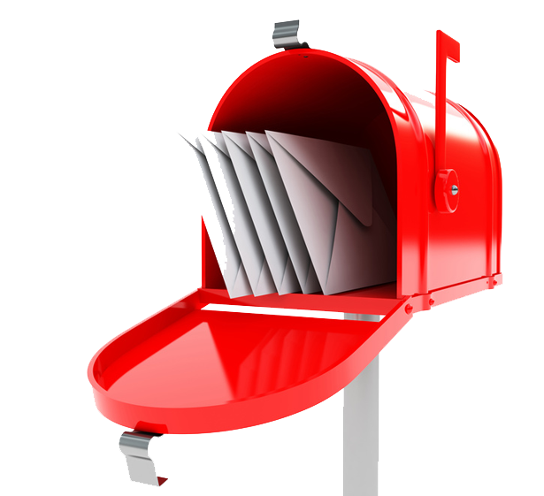
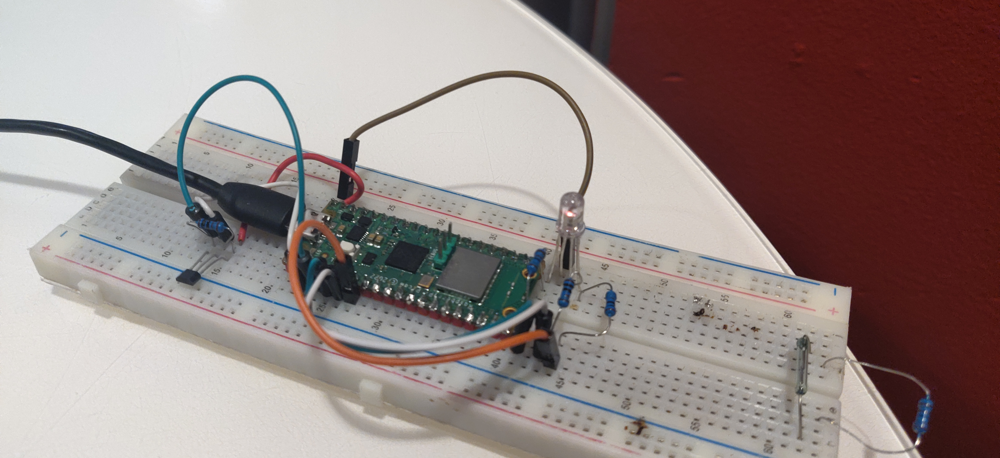
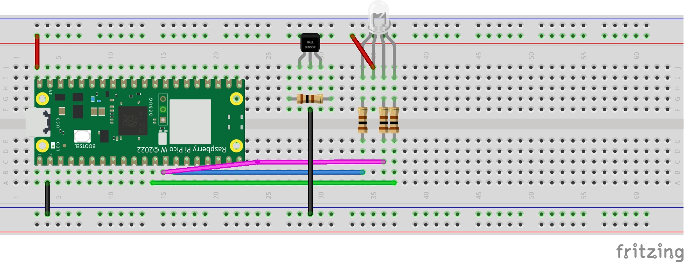

<h1 align="center">
<span>Mail<span style= "color:red">Watch</span></span>

<h4 align="center">
______backend______
</h4>

</h1>

<div align="center">
  <!-- Amazing GitHub Template - Sane defaults for your next project!
  <br />
  <br />
  <a href="https://github.com/dec0dOS/amazing-github-template/issues/new?assignees=&labels=bug&template=01_BUG_REPORT.md&title=bug%3A+">Report a Bug</a>
  ·
  <a href="https://github.com/dec0dOS/amazing-github-template/issues/new?assignees=&labels=enhancement&template=02_FEATURE_REQUEST.md&title=feat%3A+">Request a Feature</a>
  .
  <a href="https://github.com/dec0dOS/amazing-github-template/discussions">Ask a Question</a> -->
</div>

<div align="center">

<br />

</div>

<details open="open">
<summary>Table of Contents</summary>

- [About](#about)
  - [Built With](#built-with)
      - [Tech Stack](#tech-stack)
- [Getting Started](#getting-started)
  - [Prerequisites](#prerequisites)
  - [Usage](#usage)
    - [Installation](#installation)
    - [References](#references)
    - [Enviorment Variables](#enviorment-variables)
- [Development Roadmap](#development-roadmap)
- [Photos](#photos)
- [Acknowledgements](#acknowledgements)

</details>

---


## About

<table>
<tr>
<td>

<span style= "font-weight:600;">Mail <span style= "color:red;">Watch</span> </span> was built with the purpose to notify you in real-time when your mail arrive. Depending where you live your mail box may be located on different part of the house or in other cases even outside. Other times the mail might come at.

In my personal case, my mailbox is located on the first floor, while the main living quarters are on the second and third floor. To stop the guessing game of when will the mail man arrives and to avoid investing in other platforms like Ring ^TM^  I created this device.

Some other use cases for this project is notify the user when crucial  time/tempurature sensitive packages arrives or in general help people with disabilities and their caretakers 

*This backend project is only meant to be use in the local area network using a Raspberry Pi 3/4  as the web server.* 

<span style="font-weight:600">Key features</span>
<div>

- Real-time notifications (powered by Pushover)
- A simple web-based dashboard 
- View mail arrival statistics
- Only works within the local area network of you home
  

</div>


</td>
</tr>
</table>

### Built With
##### Tech Stack
- [FastAPI](https://fastapi.tiangolo.com/) - *FastAPI is a modern, fast (high-performance), web framework for building APIs with Python 3.7+ based on standard Python type hints.*
- [Unicorn](https://fastapi.tiangolo.com/) - *FastAPI is a modern, fast (high-performance), web framework for building APIs with Python 3.7+ based on standard Python type hints.*
- [PostgresSQL (SQLAlchemy)](https://www.sqlalchemy.org/) 
- [Pushover](https://pushover.net/#apps) - *push notifications*
- [TailwindCSS](https://tailwindcss.com/) - *used TailwindCSS CDN*
- [DaisyUI](https://daisyui.com/) - *TailwindCSS Componet Library*
- [Jinja2](https://palletsprojects.com/p/jinja/) - *HTML templating*
 *[Hardware Tech Stack](https://github.com/zjacobsdev/rpi_pico_device)*
## Getting Started

### Prerequisites


- Make sure to have Postgres installed and running in your local setup
    `alternative`
   - Use `test.db` as a mock database
    <br />
- Set up an account with Pushover to get retrieve your API keys

### Usage

####  Installation 

Please follow these steps for a *development* setup:

1. Fork/Clone repository
   In the terminal: 

2. `virtualenv -p python3 env`
3. `source env/bin/activate`
4. `pip3 install -r requirements.txt`
5. `unicorn server:app --reload`

  *[Hardware Installation]()*

#### References

Preview of file structure:
```bash
├── app                
│   ├── server.py      
│   ├── requirements.py
|   ├── models.py
|   ├── .env.sample   
|   ├── tests
|   ├── routes
|   ├── services       
│   ├── configs  # configurations
│   │   ├── __init__.py
│   │   ├── settings.py    
│   │   └── database.py     
│   └── templates         # Jinja2 HTML templates
│       ├── index.html  #  API Dashboard page
│       └── admin.py  
```

#### Enviorment Variables

Use `.env.sample` file  

| Variable Name              | Value Type         | Description                                                                 |
| -------------------------- | ------------------ | --------------------------------------------------------------------------- |
| DATABASE_URL              |  *string (url)* | URL of local postgres database                                               |
| PUSHOVER_API_TOKEN           |       *string*    | api token for Pushover                                 |
| PUSHOVER_USER_KEY                | *string*    | user key for Pushover                                                      |


## Development Roadmap
<table>
<tr>
<th>
In the Works</th>
<th> Down the Road </th>
</tr>
<tr>
<td style ="vertical-align:top">

  :heavy_check_mark: Save device data in csv file
- Saving device data in db

</td>
<td style ="vertical-align:top">

  - Testing 
    - test end  points with pytest
  - Add seperate frontend client
   - Deployment 
     - AWS or create local server
     - implement tests
   - Better mangange git Commits
     - precommit vs husky
   - Watchdog
   - Device Settings
     - Ability to add, delete, update device info
   - IoT Security and Authentation
     - need more research
   - Analysis
     - what the est. time of day does the mail come
     - did the mail com
   - Features
     - Add USPS/UPS/FEDEX packages

</td>
</tr>
</table>

## Photos

<figcaption align = "center"><b>Dashboard Concept</b></figcaption>


<figcaption align = "center"><b>Dashboard Concept: Mobile</b></figcaption>
<p align="center">

</p>
<figcaption align = "center"><b>Photo of the device (Barebones)</b></figcaption>

<figcaption align = "center"><b>Wiring Diagram</b></figcaption>


## Acknowledgements

Thanks in advance to anyone who contributes in growing this project in anyway


